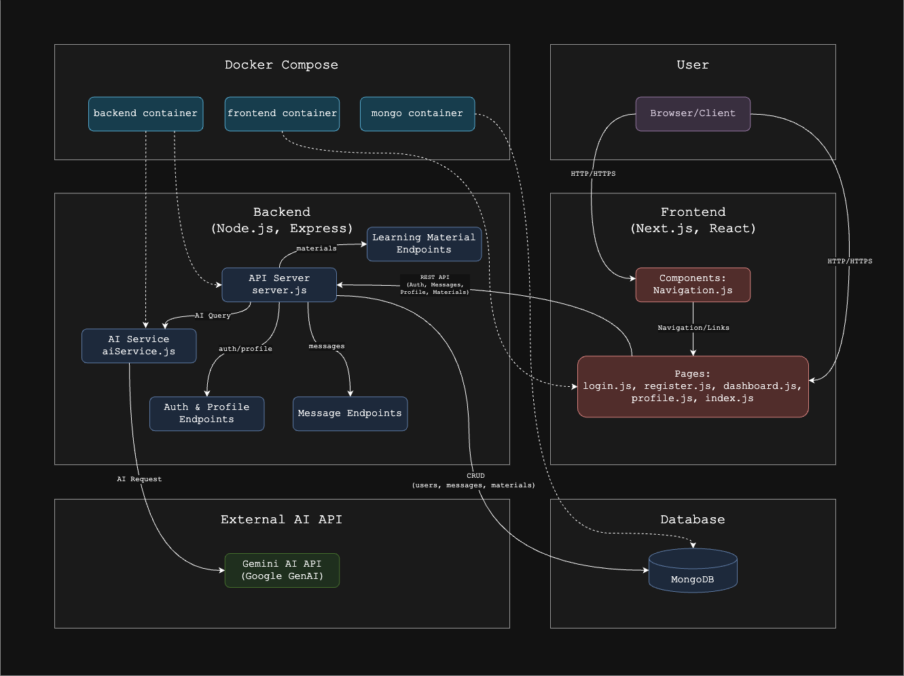

# BrainBytes AI Tutoring Platform

## Overview

BrainBytes is an AI-powered tutoring platform designed to provide accessible academic assistance to Filipino students. This project implements the platform using modern DevOps practices and containerization.

## Technology Stack

- **Frontend**: Next.js
- **Backend**: Node.js
- **Database**: MongoDB Atlas
- **AI Model Integration**: Google Gemini API 
- **Containerization**: Docker
- **CI/CD**: GitHub Actions

## Docker Version Information

- **Docker version**: `$(docker --version)`
- **Docker Compose version**: `$(docker-compose --version)`

## Architecture Diagram



This diagram shows:
- Container names and port mappings
- Data flow between components
- AI model integration service

## Instructions for Running the Application

1. Download the zip file of the repository.
2. Extract the zip file.
3. Open Command Prompt or PowerShell.
4. Navigate to the project directory:

   ```bash
   cd brainbytes-multi-container
   ```

5. Open Docker Desktop (install it if you haven't already).
6. In the terminal, still in the `brainbytes-multi-container` directory, run:

   ```bash
   docker-compose build
   ```

   The terminal should show the build process output.

7. Then, run:

   ```bash
   docker-compose up
   ```

   The application will start running.

8. Open a web browser and go to:

   ```
   http://localhost:8080/
   ```

   You should see the application interface.

---

## API Documentation for the Endpoints Created

### Messages API

- **Endpoint**: /api/messages
  - **Method**: GET
  - **Description**: Get all chat messages
  - **Request Body**: None
  - **Response**: Array of message objects

- **Endpoint**: /api/messages
  - **Method**: POST
  - **Description**: Create user message and get AI response
  - **Request Body**: `{ "text": "user question" }`
  - **Response**: AI response with metadata

#### Example Response:

```json
{
  "userMessage": { "_id": "123", "text": "What is science?", "isUser ": true, "createdAt": "2023-01-01T00:00:00Z" },
  "aiMessage": { "_id": "456", "text": "Science is...", "isUser ": false, "createdAt": "2023-01-01T00:00:05Z" },
  "category": "science",
  "questionType": "definition",
  "sentiment": "neutral"
}
```

---

### User Profiles API

- **Endpoint**: /api/users
  - **Method**: GET
  - **Description**: Get all user profiles
  - **Request Body**: None
  - **Response**: Array of user objects

- **Endpoint**: /api/users
  - **Method**: POST
  - **Description**: Create a new user profile
  - **Request Body**: User data
  - **Response**: Created user object

- **Endpoint**: /api/users/:id
  - **Method**: GET
  - **Description**: Get a specific user
  - **Request Body**: None
  - **Response**: User object

- **Endpoint**: /api/users/:id
  - **Method**: PUT
  - **Description**: Update a user profile
  - **Request Body**: Updated user data
  - **Response**: Updated user object

- **Endpoint**: /api/users/:id
  - **Method**: DELETE
  - **Description**: Delete a user profile
  - **Request Body**: None
  - **Response**: Success message

#### User Data Format:

```json
{
  "name": "John Doe",
  "email": "john@example.com",
  "preferredSubjects": ["math", "science"]
}
```

---

### Learning Materials API

- **Endpoint**: /api/materials
  - **Method**: GET
  - **Description**: Get all learning materials
  - **Request Body**: None
  - **Response**: Array of material objects

- **Endpoint**: /api/materials
  - **Method**: POST
  - **Description**: Create a new material
  - **Request Body**: Material data
  - **Response**: Created material object

- **Endpoint**: /api/materials/:id
  - **Method**: GET
  - **Description**: Get a specific material
  - **Request Body**: None
  - **Response**: Material object

- **Endpoint**: /api/materials/:id
  - **Method**: PUT
  - **Description**: Update a learning material
  - **Request Body**: Updated material data
  - **Response**: Updated material object

- **Endpoint**: /api/materials/:id
  - **Method**: DELETE
  - **Description**: Delete a learning material
  - **Request Body**: None
  - **Response**: Success message

#### Materials Data Format:

```json
{
  "subject": "math",
  "topic": "Algebra Basics",
  "content": "Algebra is a branch of mathematics..."
}
```

---

## Database Schema Design

We utilized MongoDB with the following collections:

### Messages Collection

```json
{
  "text": String,
  "isUser ": Boolean,
  "createdAt": Date
}
```

**Purpose**: Stores the conversation history between users and the AI tutor.

### User Profiles Collection

```json
{
  "name": String,
  "email": String,
  "preferredSubjects": [String],
  "createdAt": Date,
  "updatedAt": Date
}
```

**Purpose**: Stores user information and learning preferences.

### Learning Materials Collection

```json
{
  "subject": String,
  "topic": String,
  "content": String,
  "createdAt": Date,
  "updatedAt": Date
}
```

**Purpose**: Stores educational content organized by subject and topic.

---

## AI Enhancements Implemented

### Subject Categorization

- Automatically classifies questions into subjects: math, science, history, literature, geography, and language.
- Uses keyword matching and pattern recognition.
- Improves response accuracy by providing subject-specific context.

### Question Type Detection

- Identifies question types: definitions, explanations, examples, and calculations.
- Formats responses appropriately based on question type.
- Customizes API prompts for better answers.

### Sentiment Analysis

- Detects user frustration or confusion through keyword analysis.
- Provides empathetic responses when negative sentiment is detected.
- Adapts tone to improve user experience.

### Fallback Mechanism

- Provides detailed responses when the API fails.
- Includes subject-specific answers for common questions.
- Handles basic math calculations locally when possible.

### Enhanced API Integration

- Uses Google Gemini's models with optimized prompts.
- Implements timeout handling and error recovery.
- Provides graceful degradation when API is unavailable.

---

## Troubleshooting

If you encounter issues such as:

```
HTTPConnectionPool(host='localhost', port=3000): Max retries exceeded with url: /reset-password?token=${token}&email=${encodeURIComponent(email)} (Caused by NewConnectionError('<urllib3.connection.HTTPConnection object at 0x7f8affe15b50>: Failed to establish a new connection: [Errno 111] Connection refused'))
```

- Ensure that the server is running and accessible at the specified port.
- Check the logs for any errors during the build or startup process.
- Verify that the correct port is being used in the browser.

---

## Team Members

- **Rei Emmanuel C** - Team Lead - [lr.recristobal@mmdc.mcl.edu.ph]
- **Kristine E** - Backend Developer - [lr.kencabo@mmdc.mcl.edu.ph]
- **Jodienne E** - Frontend Developer - [lr.jesperas@mmdc.mcl.edu.ph]
- **Vonne Carlo P** - DevOps Engineer - [lr.vcpediengco@mmdc.mcl.edu.ph]
